# Microservices performance tuning
Microsoft patterns & practices

This reference implementation shows the process for a performance analysis of a microservices architecture. The application runs on Azure Kubernetes Service and is decribed in more detail [here](https://docs.microsoft.com/azure/architecture/microservices/design/).

Scenario: A client application sends an HTTP GET request to retreive an invoicing report. On the backend, a reverse proxy (nginx) fans out the query to several backend services. One of these services is not performing well.

This repo contains a set of load tests that stress the application. The remainder of this document describes the steps to identify and remove the bottlenecks.

> **DISCLAIMER:**
> Running these load tests will incur charges against your Azure account. Please be aware of these charges and understand any activity against the Azure instance will result in fees.

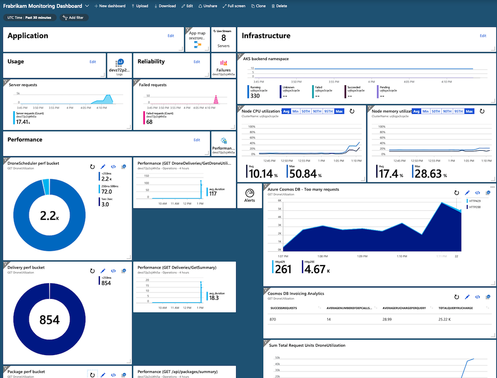

## Deploying the Reference Implementation

### Prerequisites

- Azure subscription
- [Azure CLI 2.0](https://docs.microsoft.com/en-us/cli/azure/install-azure-cli)
- [Docker](https://docs.docker.com/)
- [Helm 2.12.3 or later](https://docs.helm.sh/using_helm/#installing-helm)
- [JQ](https://stedolan.github.io/jq/download/)

> Note: in Linux systems, it is possible to run the docker command without prefacing
>       with sudo. For more information, please refer to [the Post-installation steps
>       for Linux](https://docs.docker.com/install/linux/linux-postinstall/)

Clone this repo locally.

```bash
git clone --recurse-submodules https://github.com/mspnp/microservices-perftuning.git
```

The deployment steps shown here use Bash shell commands. On Windows, you can use the [Windows Subsystem for Linux](https://docs.microsoft.com/windows/wsl/about) to run Bash.

### Deploy microservices reference implementation

Navigate to [deployment steps and deploy the microservices reference implementation](https://github.com/mspnp/microservices-reference-implementation/blob/312df17b23fb0ed559cf8428709b150c423476b6/deployment.md).

### Import Invoicing dataset

> Note: it is recommended to be executed from Azure Cloud Shell. You will want
> to clone the repo again.

<a href="https://shell.azure.com" title="Launch Azure Cloud Shell"></a>

```bash
export COLLECTION_THROUGHPUT=50000 && \
export NUMBER_OF_DOCUMENTS=14000000 && \
export NUMBER_OF_DOCUMENTS_EXP_FACTOR=0 && \
export NUMBER_OF_BATCHES=110 && \
export COLLECTION_PARTITION_KEY="/regionId" && \
export DOCUMENT_TYPE_NAME="InternalDroneUtilization"

dotnet run \
       --project $PROJECT_ROOT/src/shipping/dronescheduler/Fabrikam.DroneDelivery.DroneSchedulerService.BulkImport/Fabrikam.DroneDelivery.DroneSchedulerService.BulkImport \
       --auth-key=$AUTH_KEY \
       --endpoint-url=$ENDPOINT_URL \
       --database-name=$DATABASE_NAME \
       --collection-name=$COLLECTION_NAME \
       --collection-partition-key=$COLLECTION_PARTITION_KEY \
       --collection-throughput=$COLLECTION_THROUGHPUT \
       --document-type-name=$DOCUMENT_TYPE_NAME \
       --flatten-partition-key=false \
       --number-of-batches=$NUMBER_OF_BATCHES \
       --number-of-documents=$NUMBER_OF_DOCUMENTS \
       --number-of-documents-exp-factor=$NUMBER_OF_DOCUMENTS_EXP_FACTOR
```

### Create Invoice ingress

```bash
# Export tls data
export INVOICE_INGRESS_TLS_SECRET_NAME=invoice-ingress-tls

helm install ./charts/invoice/ \
     --set ingress.hosts[0].name=$EXTERNAL_INGEST_FQDN \
     --set ingress.hosts[0].tls=true \
     --set ingress.hosts[0].tlsSecretName=$INVOICE_INGRESS_TLS_SECRET_NAME \
     --set ingress.tls.secrets[0].name=$INVOICE_INGRESS_TLS_SECRET_NAME \
     --set ingress.tls.secrets[0].key="$(cat ingestion-ingress-tls.key)" \
     --set ingress.tls.secrets[0].certificate="$(cat ingestion-ingress-tls.crt)" \
     --set reason="Initial deployment" \
     --set tags.dev=true \
     --namespace backend-dev \
     --name invoice-v0.1.0-dev \
     --dep-up

# Verify ingress is created
helm status invoice-v0.1.0-dev
```

### Deploy Monitoring Dashboard
```bash
# export workspace id
export WORKSPACE_ID=$(az resource list -l $LOCATION --resource-type "Microsoft.OperationalInsights/workspaces" --query "[?contains(name,'DefaultWorkspace')].id" -o tsv)

az group deployment create \
   -g $RESOURCE_GROUP \
   --template-file azuredeploy.json \
   --parameters workspaceId=$WORKSPACE_ID \
                clusterName=$CLUSTER_NAME \
                appInsightsName=$AI_NAME \
                droneSchedulerCosmosDbName=$DRONESCHEDULER_COSMOSDB_NAME
```

### Setup access for current user to change values in the drone scheduler configuration key vault

```bash
export DRONESCHEDULER_KEYVAULT_NAME=$(az group deployment show --resource-group $RESOURCE_GROUP --name azuredeploy-dev --query properties.outputs.droneSchedulerKeyVaultName.value --output tsv)
export CURRENT_USER_ID=$(az ad signed-in-user show --query objectId --output tsv)
az keyvault set-policy --resource-group $RESOURCE_GROUP --name $DRONESCHEDULER_KEYVAULT_NAME --object-id $CURRENT_USER_ID --secret-permissions get list set
```

### Execute the load test

#### Context

Internally, the DroneScheduler service executes a SQL query similar to the following:

```sql
SELECT * FROM c
WHERE c.ownerId = <ownerIdValue> and
      c.year = <yearValue> and
      c.month = <monthValue>
```

#### Throttling scenario

In this scenario, the DroneScheduler service does not specify a partition key in the query. It configures the Cosmos DB client SDK to use [gateway mode](https://docs.microsoft.com/azure/cosmos-db/performance-tips) with max parallelism = 0. Cosmos DB resource untis (RUs) are set to the minimum.

```bash
# reduce the amount resource units to the minimum
az cosmosdb collection update \
   -g $RESOURCE_GROUP \
   --name $DRONESCHEDULER_COSMOSDB_NAME \
   --db-name $DATABASE_NAME \
   --collection-name $COLLECTION_NAME \
   --throughput 900

# setup max parallelism in 0
az keyvault secret set --vault-name $DRONESCHEDULER_KEYVAULT_NAME --name CosmosDBMaxParallelism 0

# restart pods
kubectl delete pods -n backend-dev -l app.kubernetes.io/instance=dronescheduler-v0.1.0-dev
```

Navigate to [Load Test readme and follow the instructions](./src/loadtests/readme.md)


#### Serial cross-partition query scenario

This scenario uses the same settings as the previous scenario, but increases the RU allocation to 2500.

```bash
# provision more resource units as consequence of 429s in previous scenario
az cosmosdb collection update \
   -g $RESOURCE_GROUP \
   --name $DRONESCHEDULER_COSMOSDB_NAME \
   --db-name $DATABASE_NAME \
   --collection-name $COLLECTION_NAME \
   --throughput 2500
```

Navigate to [Load Test readme and follow the instructions](./src/loadtests/readme.md)

#### Parallel cross-partition query scenario

This scenario adds parallelism to the Cosmos DB queries by setting MaxDegreeParallelism = -1.

```bash
# improve cosmos db calls parallelism at the cost of being more CPU/memory intensive
az keyvault secret set --vault-name $DRONESCHEDULER_KEYVAULT_NAME --name CosmosDBMaxParallelism -1

# restart pods
kubectl delete pods -n backend-dev -l app.kubernetes.io/instance=dronescheduler-v0.1.0-dev
```

Navigate to [Load Test readme and follow the instructions](./src/loadtests/readme.md)

#### Single-partition scenario

In this scenario, the query includes a partition key, resulting in a single-partition query. It also uses [direct mode](https://docs.microsoft.com/azure/cosmos-db/performance-tips) rather than gateway mode.

```bash
# change to direct mode since it can deliver better throughput
az keyvault secret set --vault-name $DRONESCHEDULER_KEYVAULT_NAME --name CosmosDBConnectionMode --value Direct

# enable the feature to start using partition key and prevent cross partition queries
az keyvault secret set --vault-name $DRONESCHEDULER_KEYVAULT_NAME --name FeatureManagement --UsePartitionKey --value true

# restart pods
kubectl delete pods -n backend-dev -l app.kubernetes.io/instance=dronescheduler-v0.1.0-dev
```

Navigate to [Load Test readme and follow the instructions](./src/loadtests/readme.md)

## Test results and metrics

> Note: both the AKS cluster and the Azure DevOps test agents were located in the very same region.

### Summary

|                                         |  Throttling scenario                                            |  Serial cross-partition query scenario                           |  Parallel cross-partition query scenario            |  Single-partition scenario                                    |  Notes                                                               |
|-----------------------------------------|-----------------------------------------------------------------|------------------------------------------------------------------|-----------------------------------------------------|---------------------------------------------------------------|----------------------------------------------------------------------|
| Partition Key                           | ownerId is not the partition key                                | ownerId is not the partition key                                 | ownerId is not the partition key                    | ownerId is the partition key                                  |                                                                      |
| Connection Policy                       | gateway mode, max parallel 0 and max buffer 100                 | gateway mode, max parallel 0 and max buffer 100                  | gateway mode, max parallelism -1 and max buffer 100 | direct mode, max parallel -1 and max buffer 100               |                                                                      |
| Resource Units                          | 900                                                             | 2500                                                             | 2500                                                | 2500                                                          |                                                                      |
| Average invoicing throughput (req/secs) | [19](#1-metrics-per-service)                                  | [23](#2-metrics-per-service)                                   | [42](#3-metrics-per-service)                      | [59](#4-metrics-per-service)                                |                                                                      |
| Total successful served requests        | [~9.8K](#1-rus-charge-custom-metric)                          | [~11K](#2-rus-charge-custom-metric)                            | [~20K](#3-rus-charge-custom-metric)               | [~29K](#4-rus-charge-custom-metric)                         | RU(s) charge custom metric or Visual Studio Load Test results        |
| Service taking most of the process time | [DroneScheduler](#1-metrics-per-service)                      | [DroneScheduler](#2-metrics-per-service)                       | [DroneScheduler](#3-metrics-per-service)          | [DroneScheduler](#4-metrics-per-service)                    |                                                                      |
| Average latency (ms)                    | [669](#1-metrics-per-service)                                 | [569](#2-metrics-per-service)                                  | [215](#3-metrics-per-service)                     | [176](#4-metrics-per-service)                               |                                                                      |
| Throttling requests                     | [yes](#1-max-consumed-rus-per-partition)                      | [no](#2-max-consumed-rus-per-partition)                        | [close](#3-max-consumed-rus-per-partition)        | [no](#4-max-consumed-rus-per-partition)                     |                                                                      |
| Other request errors                    | [no](#1-requests)                                             | [no](#2-requests)                                              | [no](#3-requests)                                 | [no](#4-requests)                                           |                                                                      |
| Number of Cosmos DB physical partitions | [9](#1-rus-charge-custom-metric)                              | [9](#2-rus-charge-custom-metric)                               | [9](#3-rus-charge-custom-metric)                  | [9](#4-rus-charge-custom-metric)                            | ResourceUnits/ResourceUnitsProvisionedPerPartition                   |
| Average Cosmos DB call per operation    | [11](#1-rus-charge-custom-metric)                             | [9](#2-rus-charge-custom-metric)                               | [10](#3-rus-charge-custom-metric)                 | [1](#4-rus-charge-custom-metric)                            |                                                                      |
| Cross partition (fan out queries)       | [yes](#1-rus-charge-custom-metric)                            | [yes](#2-rus-charge-custom-metric)                             | [yes](#3-rus-charge-custom-metric)                | [no](#4-rus-charge-custom-metric)                           |                                                                      |
| Average RUs per operation               | [29](#1-rus-charge-custom-metric)                             | [29](#2-rus-charge-custom-metric)                              | [29](#3-rus-charge-custom-metric)                 | [3.39](#4-rus-charge-custom-metric)                         |                                                                      |
| Is the system healthy?                  | no and inneficient                                              | yes, but latency still high                                      | yes but inneficient                                 | yes and efficient                                             | Metrics analysis                                                     |
| Potential bottleneck                    | [RUs](#1-max-consumed-rus-per-partition)                      | [Latencies still too high](#2-metrics-per-service)             | [RUs](#3-max-consumed-rus-per-partition)          | [CPU](#4-overal-cluster-metrics)                            |                                                                      |
| How to scale?                           | increment resource units up to 2.5K                             | increase parallelization by setting MaxParallelization -1        | specify a frequent partition key                    | scale up or out                                               | Conclusions from bottlenecks                                         |
|                                         |                                                                 |                                                                  | change to Direct Mode when possible                 |                                                               |                                                                      |

## Throttling scenario results

### [1] Metrics per service

|                                          | Replicas | ~Max CPU (mc) | ~Max Mem (MB) | Avg. Throughput*        | Max. Throughput*        | Avg (ms) | 50<sup>th</sup> (ms) | 95<sup>th</sup> (ms) | 99<sup>th</sup> (ms) |
|------------------------------------------|----------|---------------|---------------|-------------------------|-------------------------|----------|-----------|-----------|-----------|
| Nginx                                    | 1        | 49            | 119.61        | serve: 19 reqs/sec      | serve: 44 reqs/sec      | N/A      | N/A       | N/A       | N/A       |
| Package                                  | 3        | 24            | 66.17         | N/A                     | N/A                     | 1.97     | 1.00      | 5.00      | 12.00     |
| Delivery                                 | 3        | 134           | 257.45        | N/A                     | N/A                     | 21.30    | 16.40     | 37.00     | 56.30     |
| Dronescheduler                           | 3        | 589           | 290.12        | N/A                     | N/A                     | 669      | 104       | 1570      | 3270      |

*sources:
1. Serve: Visual Studio Load Test Throughout Request/Sec
2. Avg/50<sup>th</sup>/95<sup>th</sup>/99<sup>th</sup>: Azure AppInsights Performance operations
3. CPU/Mem: Azure Monitor for Containers

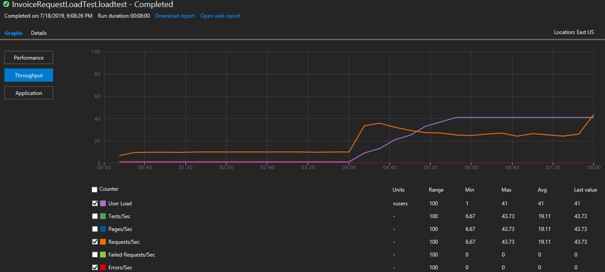

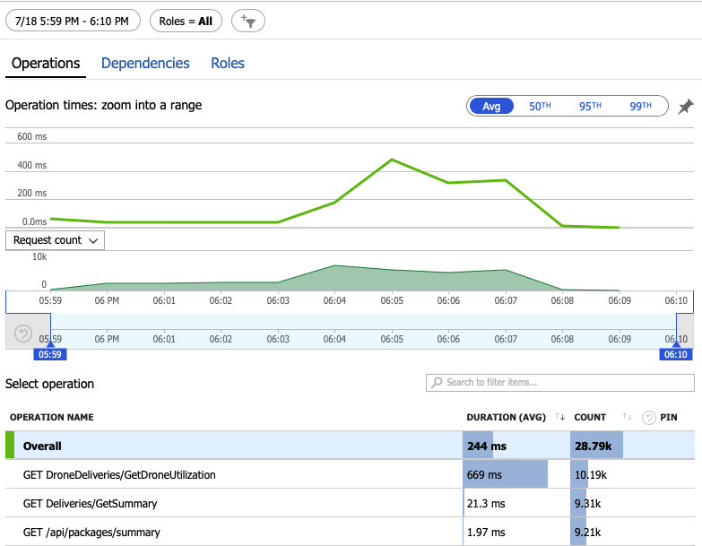

### [1] Overal cluster metrics

  - 3 x Standard D2 v2 (2 vcpus, 7 GiB memory)
  - Max. CPU: 80.22 %
  - Avg. CPU: 23.93 %

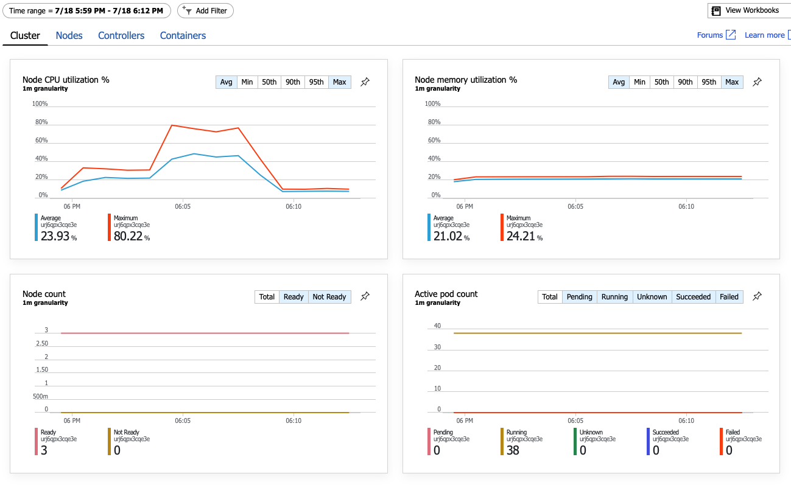

### [1] Cosmos DB Container Metrics

#### [1] RUs charge custom metric

- Total Number of successful requests: 9850
- Average of dependency calls per GET operation: 11
- Average RU(s) charge per query: 29
- Total RU(s) charge per execution: ~282K

```kusto
# navigate to Application Insights -> Logs (Analytics)
let start=datetime("2019-07-18T20:59:00.000Z");
let end=datetime("2019-07-18T21:10:00.000Z");
let operationNameToEval="GET DroneDeliveries/GetDroneUtilization";
let dependencyType="Azure DocumentDB";
let customMetricDepSpecific="CosmosDb-RequestUnits";
let operationMessage="Completed document query";
let dataset=requests
| where timestamp > start and timestamp < end
| where success == true
| where name == operationNameToEval;
dataset
| project reqOk=itemCount
| summarize
    SuccessRequests=sum(reqOk),
    TotalNumberOfDepCalls=(toscalar(dependencies
    | where timestamp > start and timestamp < end
    | where type == dependencyType
    | summarize sum(itemCount))),
    AvgRUChargePerQuery=(toscalar(traces
| where timestamp > start and timestamp < end
| where operation_Name == operationNameToEval
| where message == operationMessage
| project RUCharge=todouble(customDimensions["CosmosDb.RequestCharge"])
| summarize avg(RUCharge)))
| project
    OperationName=operationNameToEval,
    DependencyName=dependencyType,
    SuccessRequests,
    AverageNumberOfDepCallsPerOperation=(TotalNumberOfDepCalls/SuccessRequests),
    AverageRUChargePerQuery=AvgRUChargePerQuery,
    TotalQueryRUCharge=(AvgRUChargePerQuery*SuccessRequests);
```

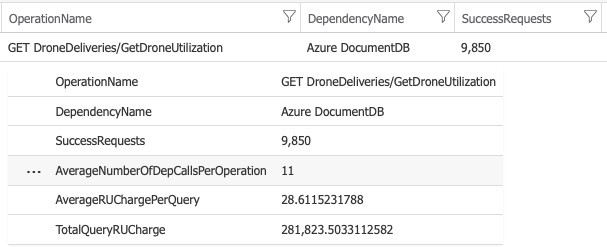

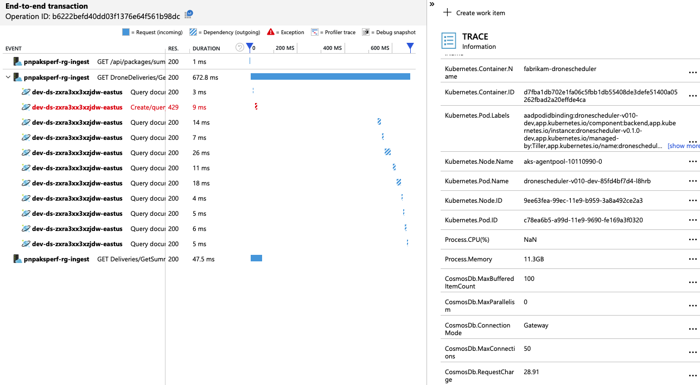

#### [1] Max consumed RUs per partition

  - Db Size: 11 GB
  - Number of Physical partitions: 9
  - Number of Logical partitions: 127K
  - Max consumption per partition: 136
  - Provisioned per partition: : 100

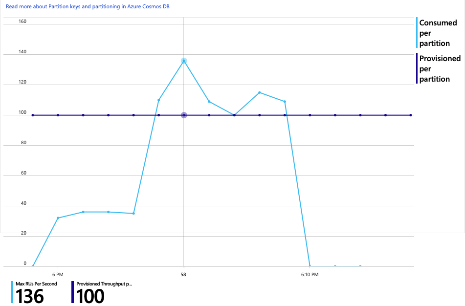

#### [1] Requests

  - Http 2xx(2): 98905 (Max ~287 requests/sec)
  - Http 429(s): 16071
  - Http 400(s): 0
  - Http 304(s): 2

```kusto
let start=datetime("2019-07-18T20:59:00.000Z");
let end=datetime("2019-07-18T21:10:00.000Z");
let excType="Microsoft.Azure.Cosmos.CosmosException";
let dataset=dependencies
| where timestamp > start and timestamp < end
| where type == "Azure DocumentDB" or type == "HTTP"
| where cloud_RoleName == "fabrikam-dronescheduler"
| where operation_Name == "GET DroneDeliveries/GetDroneUtilization";
dataset
| summarize
    Http400=sumif(itemCount, resultCode == "400"),
    Http200=sumif(itemCount, resultCode == "200"),
    Http304=sumif(itemCount, resultCode == "304"),
    Http429=sumif(itemCount, resultCode == "429")
```

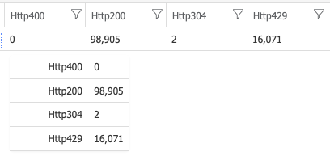

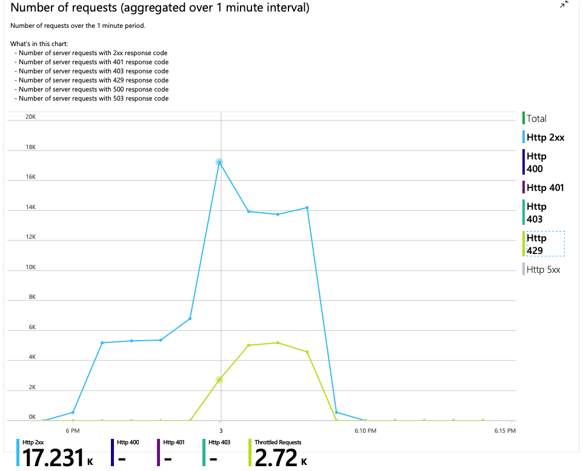

### [1] Failures

  - other failures: 10190

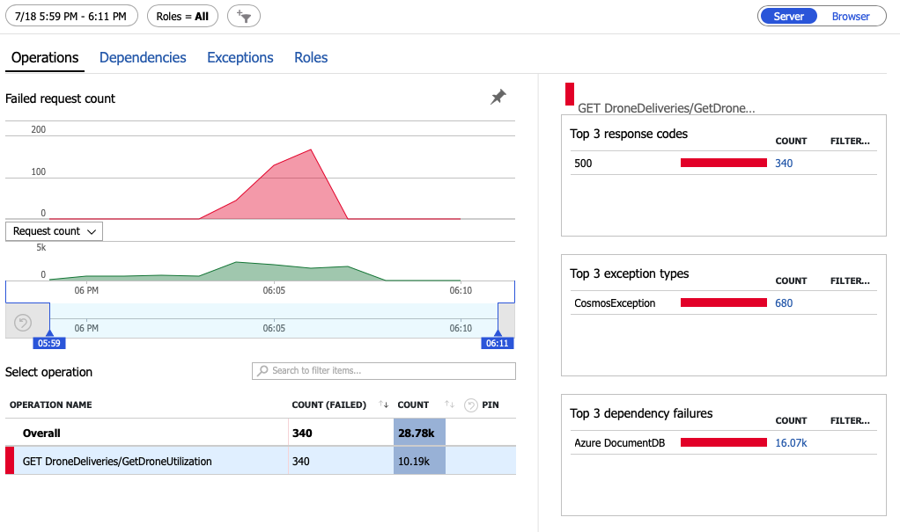

## Serial cross-partition query scenario results

### [2] Metrics per service

|                                          | Replicas | ~Max CPU (mc) | ~Max Mem (MB) | Avg. Throughput*        | Max. Throughput*        | Avg (ms) | 50<sup>th</sup> (ms) | 95<sup>th</sup> (ms) | 99<sup>th</sup> (ms) |
|------------------------------------------|----------|---------------|---------------|-------------------------|-------------------------|----------|-----------|-----------|-----------|
| Nginx                                    | 1        | 57            | 120.39        | serve: 23  reqs/sec     | serve: 47  reqs/sec     | N/A      | N/A       | N/A       | N/A       |
| Package                                  | 3        | 29            | 66.17         | N/A                     | N/A                     | 1.93     | 1.00      | 4.00      | 13.00     |
| Delivery                                 | 3        | 167           | 257.44        | N/A                     | N/A                     | 29.00    | 13.80     | 52.30     | 79.90     |
| Dronescheduler                           | 3        | 788           | 366.11        | N/A                     | N/A                     | 569      | 95.4      | 1230      | 1840      |

*sources:
1. Serve: Visual Studio Load Test Throughout Request/Sec
2. Avg/50<sup>th</sup>/95<sup>th</sup>/99<sup>th</sup>: Azure AppInsights Performance operations
3. CPU/Mem: Azure Monitor for Containers

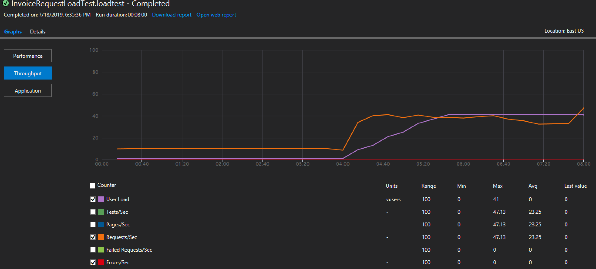

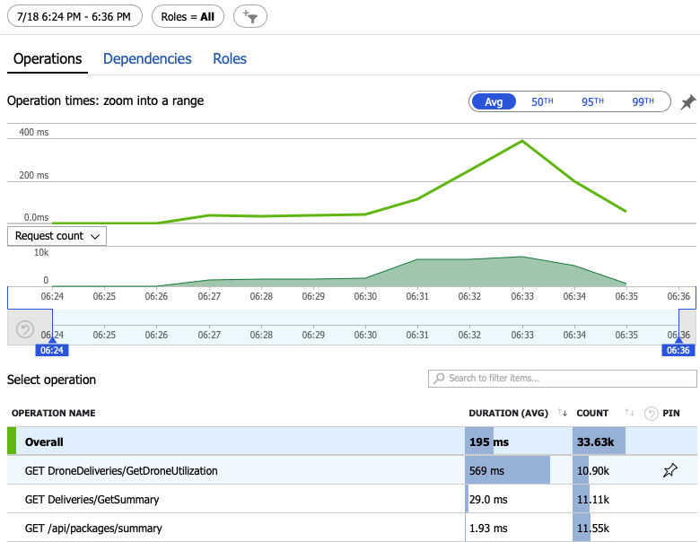

### [2] Overal cluster metrics

  - 3 x Standard D2 v2 (2 vcpus, 7 GiB memory)
  - Max. CPU: 100.91 %
  - Avg. CPU: 28.40 %

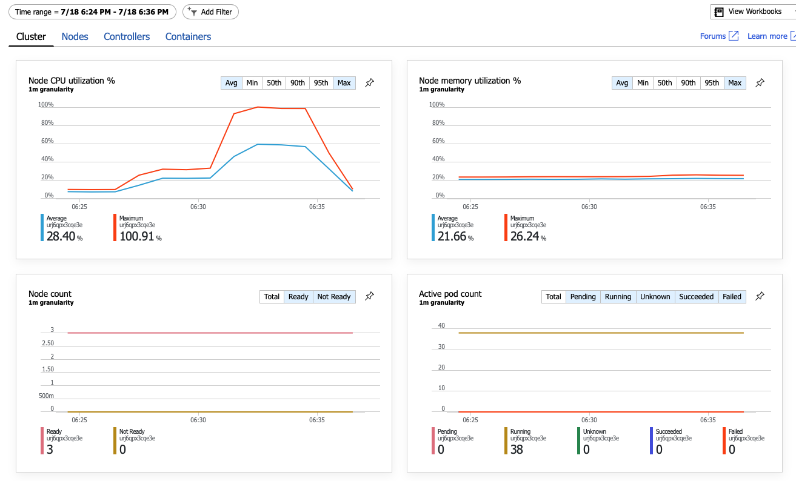

### [2] Cosmos DB Container Metrics

#### [2] RUs charge custom metric

- Total Number of successful requests: 10901
- Average of dependency calls per GET operation: 9
- Average RU(s) charge per query: 29
- Total RU(s) charge per execution: ~316K

```kusto
# navigate to Application Insights -> Logs (Analytics)
let start=datetime("2019-07-18T21:24:00.000Z");
let end=datetime("2019-07-18T21:36:00.000Z");
let operationNameToEval="GET DroneDeliveries/GetDroneUtilization";
let dependencyType="Azure DocumentDB";
let customMetricDepSpecific="CosmosDb-RequestUnits";
let operationMessage="Completed document query";
let dataset=requests
| where timestamp > start and timestamp < end
| where success == true
| where name == operationNameToEval;
dataset
| project reqOk=itemCount
| summarize
    SuccessRequests=sum(reqOk),
    TotalNumberOfDepCalls=(toscalar(dependencies
    | where timestamp > start and timestamp < end
    | where type == dependencyType
    | summarize sum(itemCount))),
    AvgRUChargePerQuery=(toscalar(traces
| where timestamp > start and timestamp < end
| where operation_Name == operationNameToEval
| where message == operationMessage
| project RUCharge=todouble(customDimensions["CosmosDb.RequestCharge"])
| summarize avg(RUCharge)))
| project
    OperationName=operationNameToEval,
    DependencyName=dependencyType,
    SuccessRequests,
    AverageNumberOfDepCallsPerOperation=(TotalNumberOfDepCalls/SuccessRequests),
    AverageRUChargePerQuery=AvgRUChargePerQuery,
    TotalQueryRUCharge=(AvgRUChargePerQuery*SuccessRequests);
```

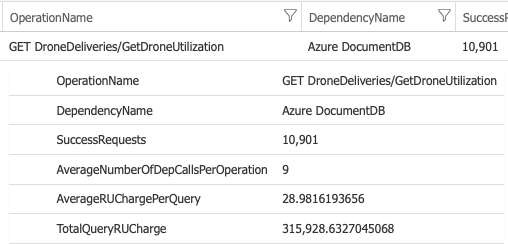

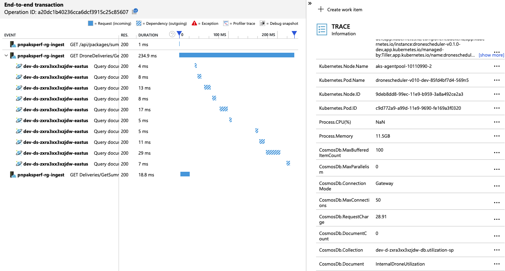

#### [2] Max consumed RUs per partition

  - Db Size: 11 GB
  - Number of Physical partitions: 9
  - Number of Logical partitions: 127K
  - Max consumption per partition: 153
  - Provisioned per partition: : ~278

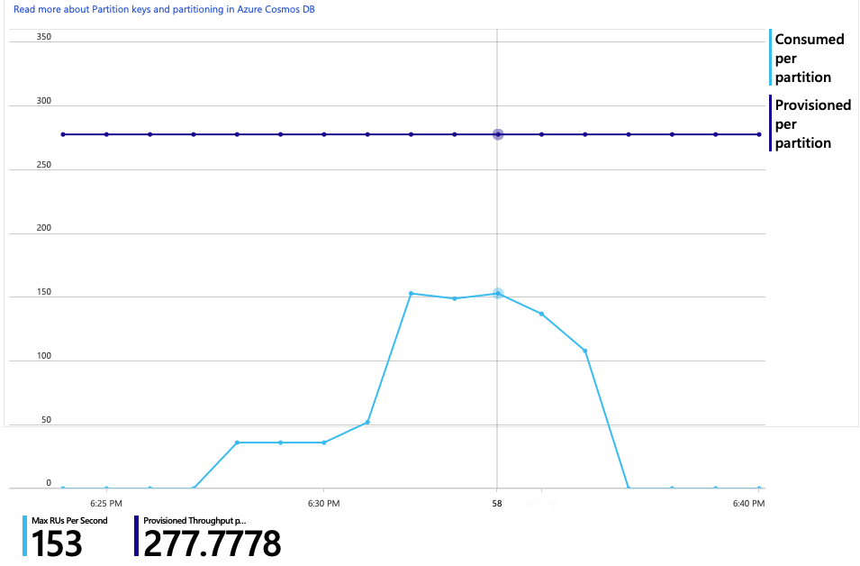

#### [2] Requests

  - Http 2xx(2): 108790 (Max ~352 requests/sec)
  - Http 429(s): 0
  - Http 400(s): 0
  - Http 304(s): 0

```kusto
let start=datetime("2019-07-18T21:24:00.000Z");
let end=datetime("2019-07-18T21:36:00.000Z");
let excType="Microsoft.Azure.Cosmos.CosmosException";
let dataset=dependencies
| where timestamp > start and timestamp < end
| where type == "Azure DocumentDB" or type == "HTTP"
| where cloud_RoleName == "fabrikam-dronescheduler"
| where operation_Name == "GET DroneDeliveries/GetDroneUtilization";
dataset
| summarize
    Http400=sumif(itemCount, resultCode == "400"),
    Http200=sumif(itemCount, resultCode == "200"),
    Http304=sumif(itemCount, resultCode == "304"),
    Http429=sumif(itemCount, resultCode == "429")
```

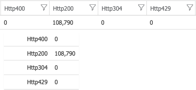

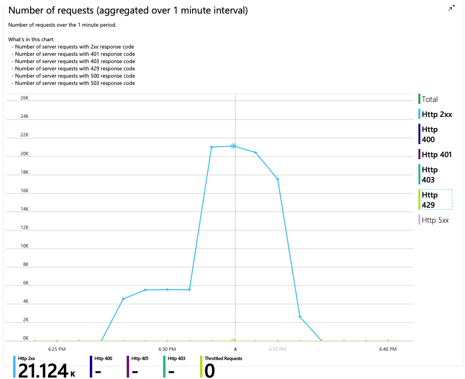

### [2] Failures

  - other failures: 0

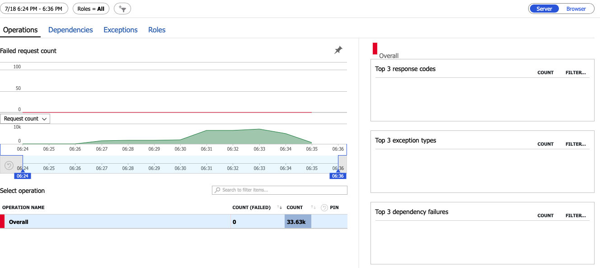

## Parallel cross-partition query scenario  results

### [3] Metrics per service

|                                          | Replicas | ~Max CPU (mc) | ~Max Mem (MB) | Avg. Throughput*        | Max. Throughput*        | Avg (ms) | 50<sup>th</sup> (ms) | 95<sup>th</sup> (ms) | 99<sup>th</sup> (ms) |
|------------------------------------------|----------|---------------|---------------|-------------------------|-------------------------|----------|-----------|-----------|-----------|
| Nginx                                    | 1        | 65            | 120.91        | serve: 42 reqs/sec      | serve: 76 reqs/sec      | N/A      | N/A       | N/A       | N/A       |
| Package                                  | 3        | 41            | 86.57         | N/A                     | N/A                     | 2.24     | 1.82      | 5.00      | 14.70     |
| Delivery                                 | 3        | 267           | 257.43        | N/A                     | N/A                     | 28.20    | 12.70     | 45.80     | 78.80     |
| Dronescheduler                           | 3        | 1107          | 451.46        | N/A                     | N/A                     | 215      | 50.80     | 435       | 764       |

*sources:
1. Serve: Visual Studio Load Test Throughout Request/Sec
2. Avg/50<sup>th</sup>/95<sup>th</sup>/99<sup>th</sup>: Azure AppInsights Performance operations
3. CPU/Mem: Azure Monitor for Containers

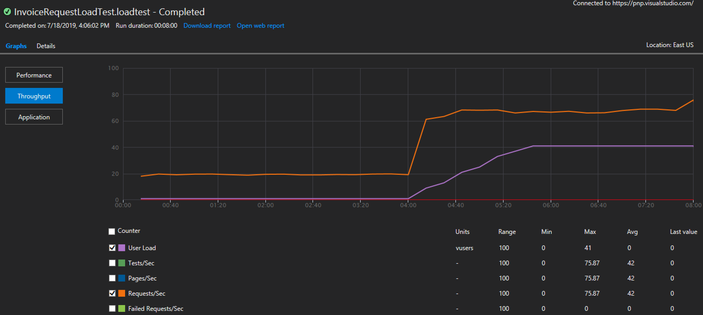

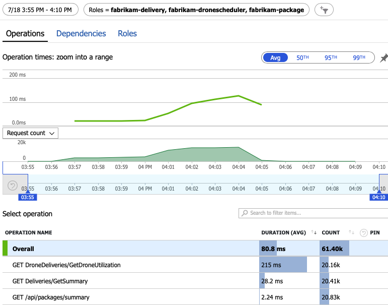

### [3] Overal cluster metrics

  - 3 x Standard D2 v2 (2 vcpus, 7 GiB memory)
  - Max. CPU: 98.75 %
  - Avg. CPU: 37.12 %

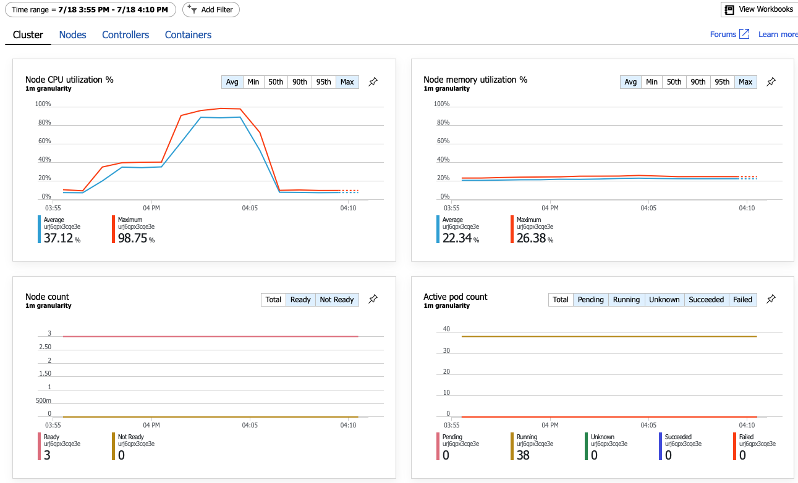

### [3] Cosmos DB Container Metrics

#### [3] RUs charge custom metric

- Total Number of successful requests: 20162
- Average of dependency calls per GET operation: 29
- Average RU(s) charge per query: 10
- Total RU(s) charge per execution: ~584K

```kusto
# navigate to Application Insights -> Logs (Analytics)
let start=datetime("2019-07-18T18:55:00.000Z");
let end=datetime("2019-07-18T19:10:00.000Z");
let operationNameToEval="GET DroneDeliveries/GetDroneUtilization";
let dependencyType="Azure DocumentDB";
let customMetricDepSpecific="CosmosDb-RequestUnits";
let operationMessage="Completed document query";
let dataset=requests
| where timestamp > start and timestamp < end
| where success == true
| where name == operationNameToEval;
dataset
| project reqOk=itemCount
| summarize
    SuccessRequests=sum(reqOk),
    TotalNumberOfDepCalls=(toscalar(dependencies
    | where timestamp > start and timestamp < end
    | where type == dependencyType
    | summarize sum(itemCount))),
    AvgRUChargePerQuery=(toscalar(traces
| where timestamp > start and timestamp < end
| where operation_Name == operationNameToEval
| where message == operationMessage
| project RUCharge=todouble(customDimensions["CosmosDb.RequestCharge"])
| summarize avg(RUCharge)))
| project
    OperationName=operationNameToEval,
    DependencyName=dependencyType,
    SuccessRequests,
    AverageNumberOfDepCallsPerOperation=(TotalNumberOfDepCalls/SuccessRequests),
    AverageRUChargePerQuery=AvgRUChargePerQuery,
    TotalQueryRUCharge=(AvgRUChargePerQuery*SuccessRequests);
```

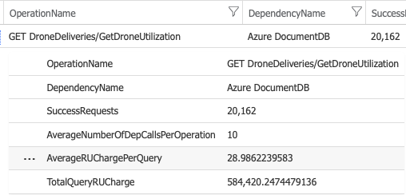

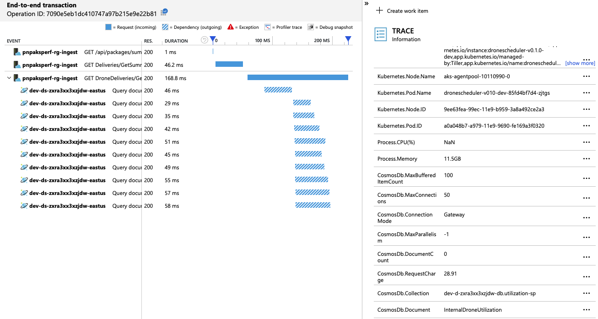

#### [3] Max consumed RUs per partition

  - Db Size: 11 GB
  - Number of Physical partitions: 9
  - Number of Logical partitions: 127K
  - Max consumption per partition: 250
  - Provisioned per partition: : ~278

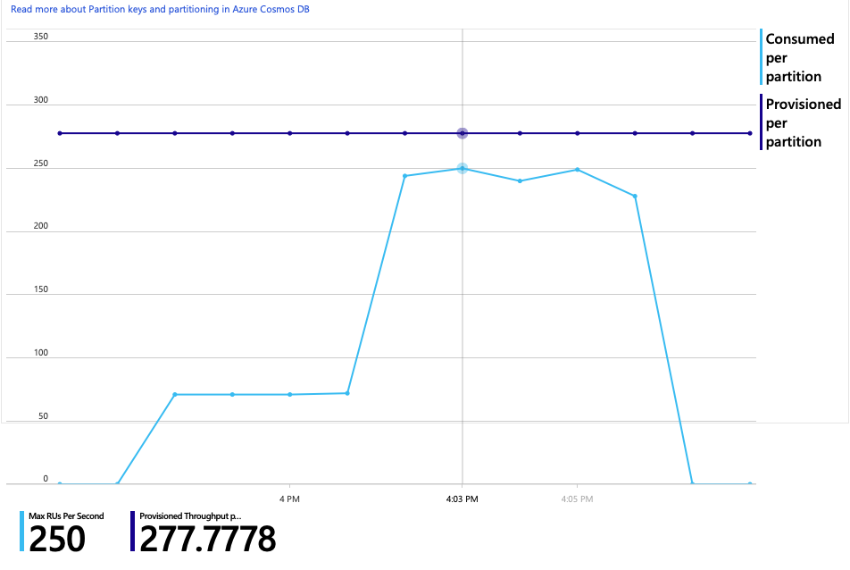

#### [3] Requests

  - Http 2xx(2): 201620  (Max ~ 616 requests/sec)
  - Http 429(s): 0
  - Http 400(s): 0
  - Http 304(s): 0

```kusto
let start=datetime("2019-07-18T18:55:00.000Z");
let end=datetime("2019-07-18T19:10:00.000Z");
let excType="Microsoft.Azure.Cosmos.CosmosException";
let dataset=dependencies
| where timestamp > start and timestamp < end
| where type == "Azure DocumentDB" or type == "HTTP"
| where cloud_RoleName == "fabrikam-dronescheduler"
| where operation_Name == "GET DroneDeliveries/GetDroneUtilization";
dataset
| summarize
    Http400=sumif(itemCount, resultCode == "400"),
    Http200=sumif(itemCount, resultCode == "200"),
    Http304=sumif(itemCount, resultCode == "304"),
    Http429=sumif(itemCount, resultCode == "429")
```

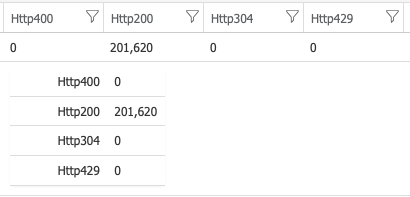

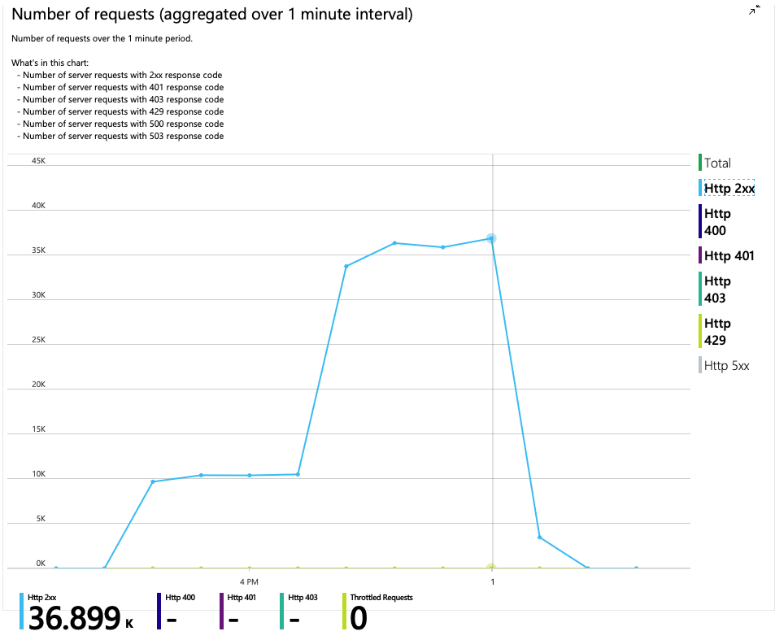

### [3] Failures

  - other failures: 0

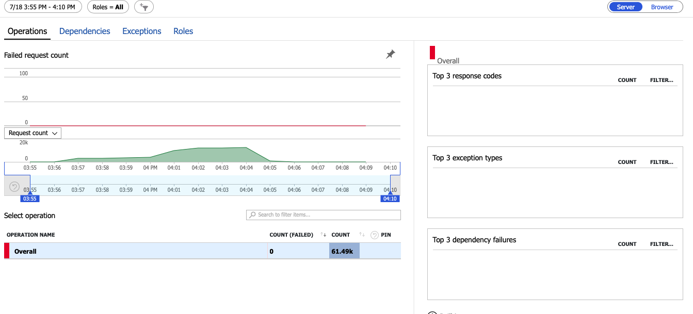

## Single-partition scenario results

### [4] Metrics per service

|                                          | Replicas | ~Max CPU (mc) | ~Max Mem (MB) | Avg. Throughput*        | Max. Throughput*        | Avg (ms) | 50<sup>th</sup> (ms) | 95<sup>th</sup> (ms) | 99<sup>th</sup> (ms) |
|------------------------------------------|----------|---------------|---------------|-------------------------|-------------------------|----------|-----------|-----------|-----------|
| Nginx                                    | 1        | 116           | 119.55        | serve: 59  reqs/sec     | serve: 99  reqs/sec     | N/A      | N/A       | N/A       | N/A       |
| Package                                  | 3        | 61            | 88.24         | N/A                     | N/A                     | 2.19     | 1.00      | 5.00      | 14.30     |
| Delivery                                 | 3        | 393           | 255.77        | N/A                     | N/A                     | 32.60    | 15.40     | 57.00     | 97.40     |
| Dronescheduler                           | 3        | 891           | 332.24        | N/A                     | N/A                     | 176      | 37.50     | 268       | 685       |

*sources:
1. Serve: Visual Studio Load Test Throughout Request/Sec
2. Avg/50<sup>th</sup>/95<sup>th</sup>/99<sup>th</sup>: Azure AppInsights Performance operations
3. CPU/Mem: Azure Monitor for Containers

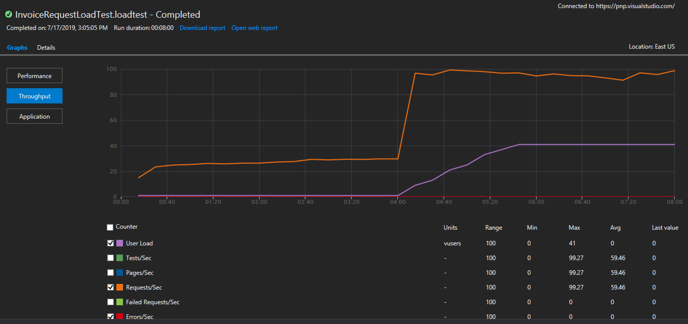

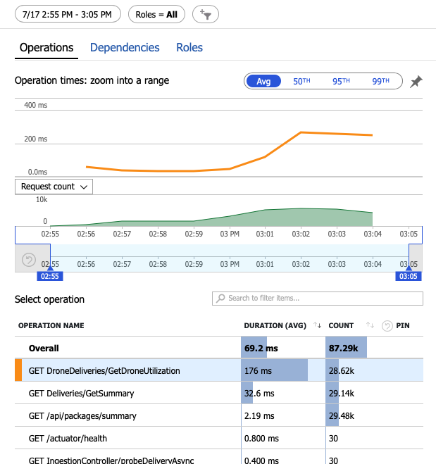

### [4] Overal cluster metrics

  - 3 x Standard D2 v2 (2 vcpus, 7 GiB memory)
  - Max. CPU: 98.99 %
  - Avg. CPU: 46.12 %

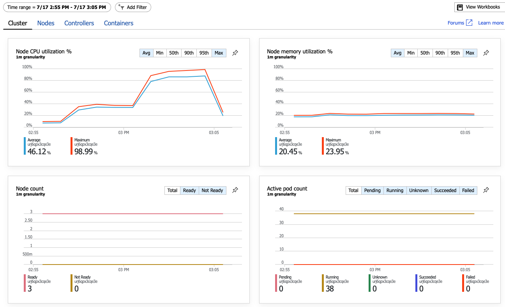

### [4] Cosmos DB Container Metrics

#### [4] RUs charge custom metric

- Total Number of successful requests: 28616
- Average of dependency calls per GET operation: 1
- Average RU(s) charge per query: 3.4
- Total RU(s) charge per execution: ~97K

```kusto
# navigate to Application Insights -> Logs (Analytics)
let start=datetime("2019-07-17T17:55:00.000Z");
let end=datetime("2019-07-17T18:05:00.000Z");
let operationNameToEval="GET DroneDeliveries/GetDroneUtilization";
let dependencyType="Azure DocumentDB";
let customMetricDepSpecific="CosmosDb-RequestUnits";
let operationMessage="Completed document query";
let dataset=requests
| where timestamp > start and timestamp < end
| where success == true
| where name == operationNameToEval;
dataset
| project reqOk=itemCount
| summarize
    SuccessRequests=sum(reqOk),
    TotalNumberOfDepCalls=(toscalar(dependencies
    | where timestamp > start and timestamp < end
    | where type == dependencyType
    | summarize sum(itemCount))),
    AvgRUChargePerQuery=(toscalar(traces
| where timestamp > start and timestamp < end
| where operation_Name == operationNameToEval
| where message == operationMessage
| project RUCharge=todouble(customDimensions["CosmosDb.RequestCharge"])
| summarize avg(RUCharge)))
| project
    OperationName=operationNameToEval,
    DependencyName=dependencyType,
    SuccessRequests,
    AverageNumberOfDepCallsPerOperation=(TotalNumberOfDepCalls/SuccessRequests),
    AverageRUChargePerQuery=AvgRUChargePerQuery,
    TotalQueryRUCharge=(AvgRUChargePerQuery*SuccessRequests);
```

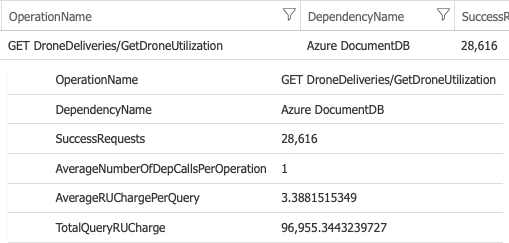

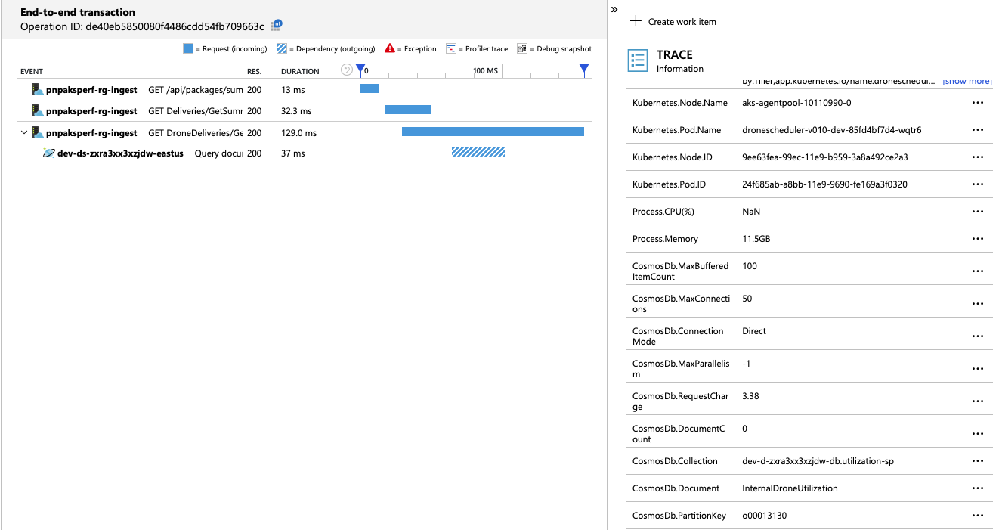

#### [4] Max consumed RUs per partition

  - Db Size: 11 GB
  - Number of Physical partitions: 9
  - Number of Logical partitions: 127K
  - Max consumption per partition: 69
  - Provisioned per partition: : ~278

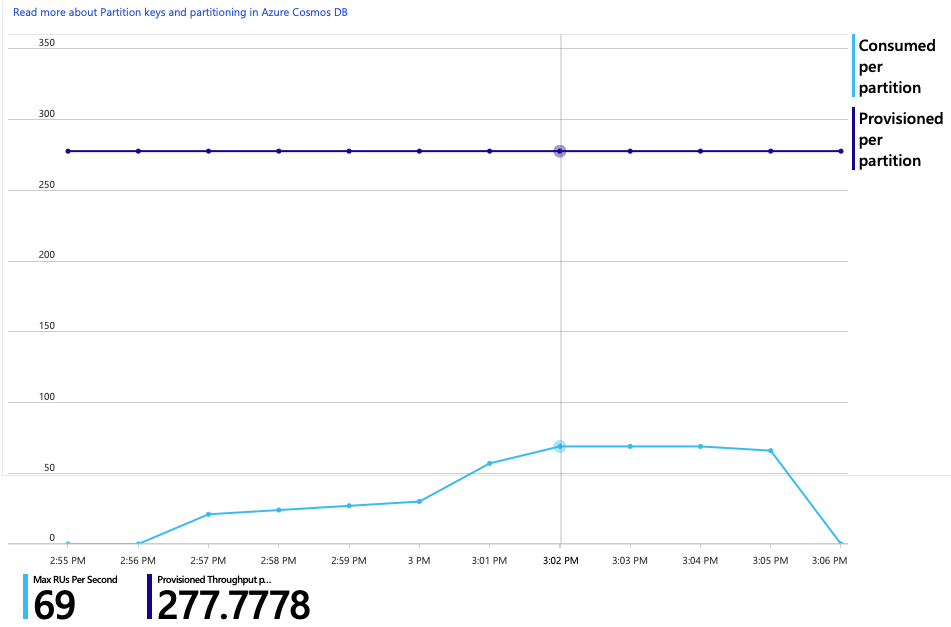

#### [4] Requests

  - Http 2xx(2): 28661 (Max ~98 requests/sec)
  - Http 429(s): 0
  - Http 400(s): 0
  - Http 304(s): 2

```kusto
let start=datetime("2019-07-17T17:55:00.000Z");
let end=datetime("2019-07-17T18:05:00.000Z");
let excType="Microsoft.Azure.Cosmos.CosmosException";
let dataset=dependencies
| where timestamp > start and timestamp < end
| where type == "Azure DocumentDB" or type == "HTTP"
| where cloud_RoleName == "fabrikam-dronescheduler"
| where operation_Name == "GET DroneDeliveries/GetDroneUtilization";
dataset
| summarize
    Http400=sumif(itemCount, resultCode == "400"),
    Http200=sumif(itemCount, resultCode == "200"),
    Http304=sumif(itemCount, resultCode == "304")
| project Http400,
          Http200,
          Http304,
          TooManyRequests=(toscalar(exceptions
            | where timestamp > start and timestamp < end
            | where type == excType
            | where outerMessage contains "429"
            | summarize sum(itemCount))) // for direct mode
```

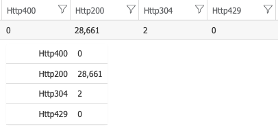

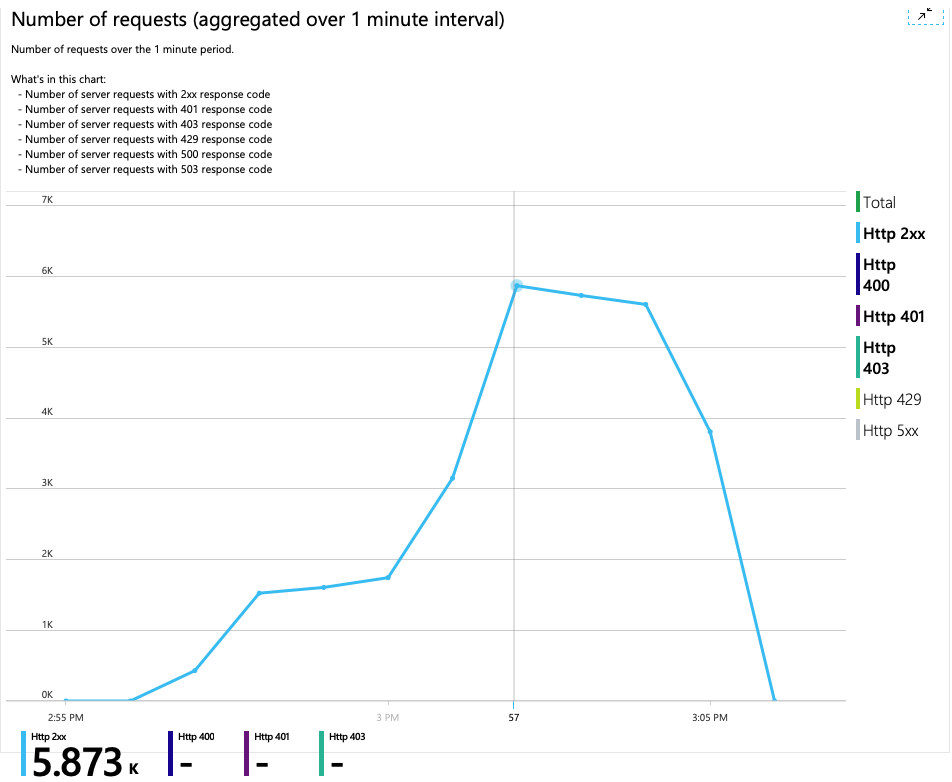

### [4] Failures

  - other failures: 0

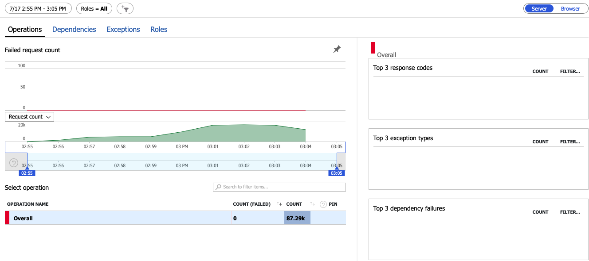


---

This project has adopted the [Microsoft Open Source Code of Conduct](https://opensource.microsoft.com/codeofconduct/). For more information see the [Code of Conduct FAQ](https://opensource.microsoft.com/codeofconduct/faq/) or contact [opencode@microsoft.com](mailto:opencode@microsoft.com) with any additional questions or comments.
